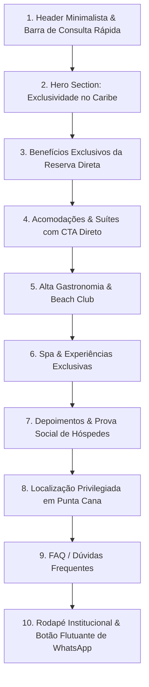

# Pesquisa & Benchmarking — Viento del Caribe

> Estudo de referências, arquitetura de informação, gatilhos de conversão direta e direção visual para o resort fictício **Viento del Caribe**.

---

## 1. Benchmarking de Hospitalidade de Luxo

Análise das melhores práticas de marcas de referência mundial no segmento de luxo (como *Aman Resorts, Rosewood, Belmond e Six Senses*), adaptadas para o foco em **conversão direta via WhatsApp**:

### Padrões Observados em Resorts 5 Estrelas:
1. **Menos é Mais (Minimalismo Editorial):** Sites de ultraluxo não poluem a tela com banners promocionais vermelhos ou contadores de escassez falsos. Eles vendem *desejo, calma e exclusividade*.
2. **Fotografia Imersiva e Espaço Negativo:** Imagens com enquadramentos cinematográficos (mar caribenho, pôr do sol, interiores em madeira nobre e linho) respirando com bastante espaço em branco/off-white.
3. **Desmistificação da Tarifa:** Hotéis de luxo que convertem direto deixam claro que o melhor canal para reservar é com o próprio hotel, oferecendo benefícios que as OTAs não conseguem entregar.

---

## 2. Estratégia de Desintermediação (Por Que Reservar Direto?)

Para fazer o hóspede trocar o Booking/Expedia pelo contato direto no WhatsApp, o site precisa apresentar o **"Club Viento Direct" / Benefícios Exclusivos da Reserva Direta**:

| Benefício da Reserva Direta | Por que Converte |
| :--- | :--- |
| **Melhor Tarifa Garantida** | Remove a dúvida se o Booking está mais barato. |
| **Drink de Boas-Vindas & Amenity de Cortesia** | Cria sensação de atendimento VIP desde a chegada. |
| **Prioridade em Early Check-in / Late Check-out** | Um dos maiores desejos de quem viaja a lazer. |
| **Crédito de USD 50 para o Spa** | Estimula o consumo interno e agrega valor imediato. |
| **Atendimento Dedicado com Concierge** | Personalização de transfer, passeios e jantares antes mesmo do check-in. |

---

## 3. Arquitetura de Informação (Estrutura do Site)

Uma página fluida (One-Page imersiva) com narrativa visual e comercial projetada para guiar o olhar até o WhatsApp:

### Detalhamento das Seções:

1. **Header Fixo (Glassmorphism):**
   - Logotipo sutil do *Viento del Caribe*.
   - Links âncora: *O Resort, Acomodações, Gastronomia, Experiências, Benefícios*.
   - Botão de Ação: *"Consultar disponibilidade"*.

2. **Hero Section + Barra Interativa de Consulta:**
   - Headline evocativa sobre viver o melhor do Caribe.
   - **Barra de Consulta Rápida:** Campos de *Data de Entrada*, *Data de Saída*, *Hóspedes* e *Categoria de Suíte* que montam automaticamente o texto pré-formatado para o WhatsApp.

3. **Gatilhos da Reserva Direta:**
   - Destaque elegante dos 4 principais privilégios de reservar direto.

4. **Showcase de Acomodações:**
   - Cards com visual editorial das 3 principais categorias (*Oceanfront Suite*, *Private Pool Villa*, *Royal Penthouse*).
   - Metragem, destaques (cama king, piscina privativa, vista para o oceano).
   - Botão em cada card: *"Consultar esta suíte"*.

5. **Gastronomia & Beach Club:**
   - Destaque para culinária caribenha contemporânea e mediterrânea à beira-mar.

6. **Wellness, Spa & Experiências:**
   - Massagens com vista para o mar, passeios de catamarã privativo e jantares sob as estrelas.

7. **Prova Social e Avaliações:**
   - Depoimentos reais e pontuação média (ex: *4.9/5 estrelas de excelência*).

8. **FAQ Estratégico:**
   - Respostas claras sobre transfer do aeroporto de Punta Cana, políticas e facilidades.

---

## 4. Direção Visual & Design System

### Paleta de Cores "Caribe Sofisticado":
- **Fundo Principal (Sand & Ivory):** `#FBF9F5` (Off-white aconchegante) e `#FFFFFF` (Branco puro nos cards).
- **Azul Oceano Profundo (Textos & Primário):** `#0B2545` (Elegante, alto contraste, sem a frieza do preto puro).
- **Verde Água-Marinha / Esmeralda (Acentos de Natureza):** `#1D7874` (Tons de lagoa caribenha).
- **Dourado Champagne / Areia Quente (Detalhes & Badges):** `#C5A880` / `#D4AF37` (Transmite luxo e exclusividade).
- **Verde WhatsApp (Conversão):** `#25D366` (No botão flutuante e acentos de CTA).

### Tipografia:
- **Títulos (Headings):** Fonte Serif elegante (ex: *Cormorant Garamond* ou *Playfair Display* via Google Fonts).
- **Textos de Apoio & UI:** Fonte Sans-Serif moderna e limpa (ex: *Plus Jakarta Sans* ou *Inter*).

---

## 5. Mecânica do Link de WhatsApp Inteligente

Em vez de abrir uma conversa vazia com "Olá", o botão coletará os dados da barra de consulta ou do card da suíte e gerará uma mensagem personalizada:

> *"Olá! Gostaria de consultar disponibilidade no Viento del Caribe para a [Oceanfront Suite], período de [15/10] a [20/10], para [2 adultos]. Poderiam me enviar as tarifas com os benefícios da reserva direta?"*

Isso reduz a fricção, qualifica o lead imediatamente e agiliza o fechamento pelo atendente.
